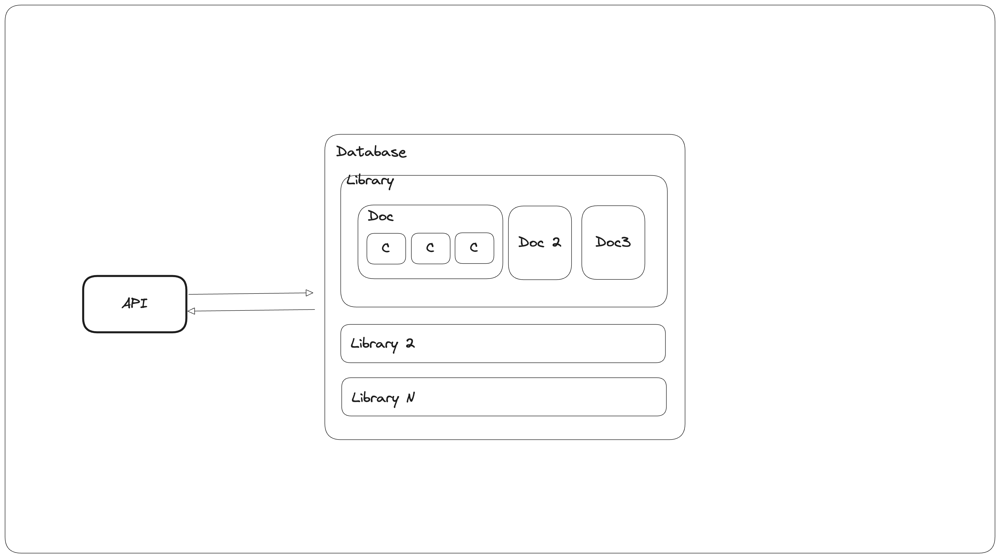
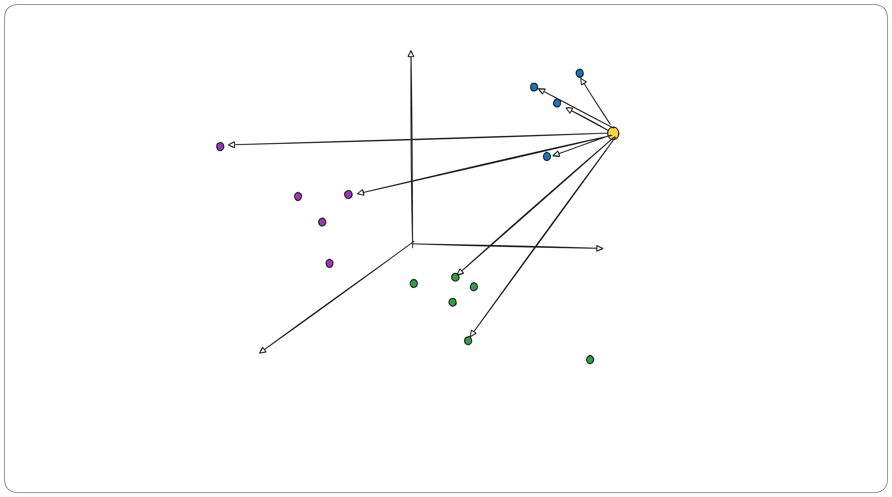
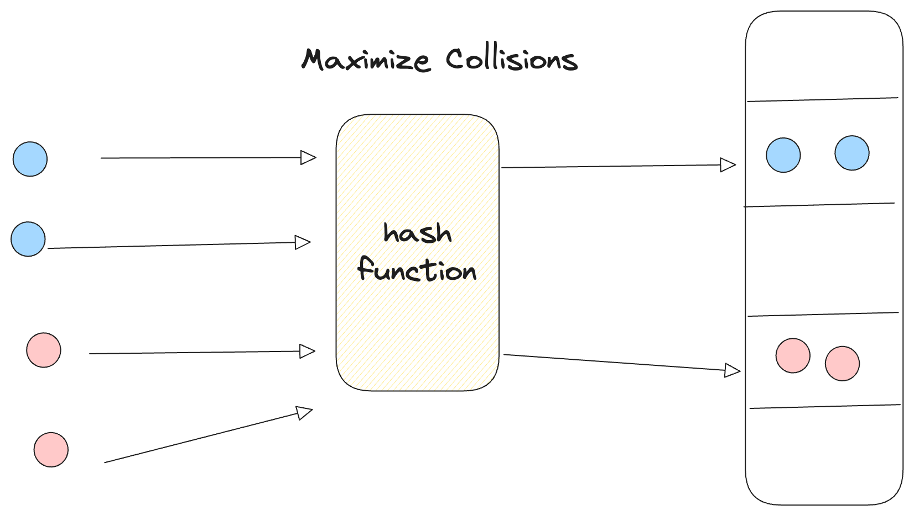

# vector-db

This project is an implementation of a vector database written from scratch. 

## Getting Started

To install this project, simply clone the repository:

```bash
git clone https://github.com/farhan0167/vector-db.git
cd vector-db/src/
```

Then create a `.env` file, and paste the following:

```
COHERE_API_KEY=<cohere-api-key>
PYTEST_DB_URI=http://localhost:8000
```

Once cloned, and within `src/`, you will have two options to spin up the database:
- via Docker, or
- through a standalone Kubernetes cluster.

### Running as a standalone Docker container
1. Build the container:
    ```bash
    docker build -t vector-db-image:latest .
    ```
2. Spin a container
   ```bash
   docker run --name vector-db -p 8000:8000 vector-db-image:latest 
   ```

### Launching a Kubernetes Cluster

#### Prerequisite
Make sure you have the following installed in your system:
- [Minikube](https://minikube.sigs.k8s.io/docs/): Helps you spin up a local k8 cluster
- [Helm](https://helm.sh/): A package manager for Kubernetes

#### Running `vector-db` on k8
1. Spin up minikube
   ```bash
   minikube start
   ```
2. Build the docker image
   ```bash
    eval $(minikube docker-env)
    docker build -t vector-db-image .  
   ```
3. Deploy using Helm
   ```bash
   helm install vector-db ./vector_db-chart/
   ```
   **Note**: If you previously installed `vector-db`, you'll need to uninstall it:

   ```bash
   helm uninstall vector-db
   ```

4. Check if the service is available
   ```bash
   kubectl get svc
   ```
5. Launch the service
   ```bash
   minikube service vector-db
   ```

## API Documentation

A great way to see all the available methods and endpoints to interact with the library would be to
navigate to `http://localhost:<port>/redoc`

## Conceptual Guide

On a high level, **vector-db** can be summarized by the following diagram:


The vector database is made up of:

- **Database**: The top-level object that holds a collection of libraries. It serves as the central structure for organizing and storing all content.
- **Library**: A library is a group of related documents. It acts as a controller for both documents and their corresponding chunks.
- **Document**: A document represents a single piece of text (e.g., an article or report). To enable more efficient retrieval, documents are split into smaller segments called chunks. This allows the system to return only the most relevant parts, avoiding the limitations of an LLM's context window.
- **Chunk**: Chunks are the smaller text segments derived from a document. In vector-db, each chunk is embedded individually and is the core unit returned in a retrieval query.
- **API**: The API provides an interface for users to interact with the database, enabling operations such as storing, querying, and retrieving documents or chunks.

## System Design

When designing a retrival system, the system should be able to:
- Provide accurate recommendations
- Retrive with low latency, without sacrificing on accuracy

For this project, we aim for lower search latency as an objective. Before we discuss about vector search indexes, I also want to introduce a few other indexes we'll be using to organize Libraries, Documents and Chunks. 

### Non Vector Search

A database holds a collection of libraries, and a library consists of a list of documents, followed by documents consisting of a list of chunks. Each object in the project stores every child object in a list. A search over a list would usually cost us a O(n) time complexity, where n being the number of child objects a parent object is holding. Therefore, we implement, what we call is a `CollectionsIndex`. Put simply, it's a hash map that maps some child object identifier to the index of the collection/list it resides in. Consider the following:

```python

documents = [c1, c2, c3, ..... cN]
 index   =   0,  1,   2,........N-1
```

What a `CollectionsIndex` does is simply map:

```python
{
   c1: 0,
   c2: 1
}
```
You could argue that I could've simply used a dictionary holding an id and the object, but this way, we can track other metadata as well. For instance in a Library, a document can be identified via both its name and id. Instead of storing two dictionaries with 2 copies of Document, we store a single Document within the list of documents, with two dictionaries storing only the identifier of interest and the index within the list where the Document is located. This way, we can perform searches over documents at O(1) time. Insertion is O(1) as well since we're assigning the index as `len(Collections)-1`. Removal, however, is O(N) since once we remove an item from the list, we'll need to recompute the entire index but this is a cost we're okay with, so long search and insertion is fast.

### Vector Search

When it comes to searching over a vector space, we have the following problem:

Given a query vector, Q, search all the embeddings and return the k-nearest vectors. This problem can nicely be summarized by the diagram below:



In this project, we call this the FlatL2 Index. What this does is, given a query, we perform a brute force search over the entire vector space via calculating the euclidean l2 distance between the query vector and all the existing vectors, and return only the K nearest neighbors to the query vector(here k is a configurable parameter set by the user).

However, we can do better. Instead of searching the entire vector space, we can use Locality Sensitive Hashing (LSH) to reduce the search space. You can learn more about LSH Index [here](https://www.pinecone.io/learn/series/faiss/locality-sensitive-hashing-random-projection/). The idea is simple, we hash similar vectos into the same bucket.



Therefore in order to hash similar vectors in the same bucket, we need a hash function that will maximize the collisions, and we can do that by taking a dense vector, such as an embedding, and compress it down to a binary string. Therefore, in the future, when a query comes in, we use the same hash function to compute a binary string and look up the binary string key in the hash table. If that key exists, the values associated become the search space and if the key doesn't exist, we use the N nearest buckets(computed using the hamming distance between two binary strings) to get the search space. 